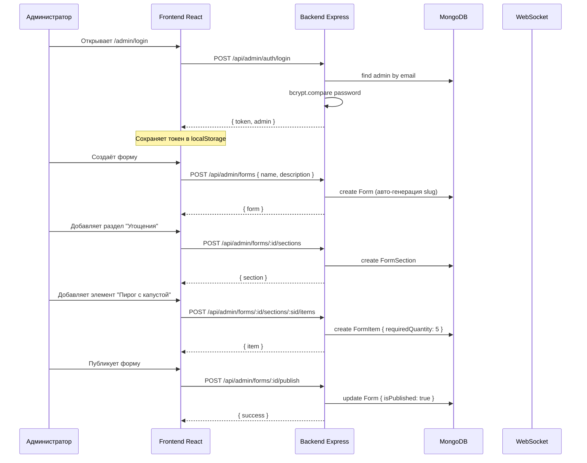
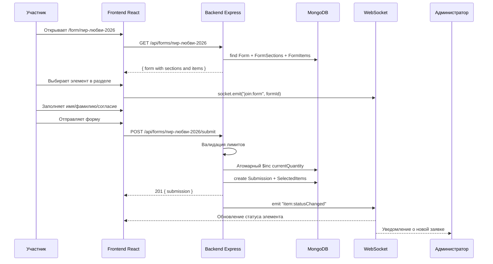

# План доработки приложения «Конструктор форм»

## Текущее состояние

Проект имеет инфраструктуру (Docker, nginx, Vite) и базовый каркас, но **весь код бэкенда и фронтенда отсутствует** — все директории содержат только `.gitkeep`.

**Собирается, но не работает:** Docker контейнеры запускаются, но:

- Бэкенд не подключён к MongoDB, нет API-эндпоинтов
- Фронтенд показывает только заглушки `<div>Admin Panel</div>`
- Создать форму невозможно

---

## Потоки реализации

Работу нужно выполнить в **3 параллельных потока**:

```
┌─────────────────────────────────────────────────────────────┐
│                    Stream 1: Backend                         │
│  config → models → middleware → utils → routes/controllers   │
│  → services → socket → server.ts                             │
├─────────────────────────────────────────────────────────────┤
│                    Stream 2: Frontend                         │
│  types → api/client → store → services → hooks → components  │
│  → pages → App.tsx                                           │
├─────────────────────────────────────────────────────────────┤
│                    Stream 3: Infrastructure                   │
│  Исправить .env, проверить Dockerfile, финальная интеграция  │
└─────────────────────────────────────────────────────────────┘
```

---

## Поток 1: Бэкенд (backend)

### 1.1 Конфигурация (src/config/)

**Файлы для создания:**

| Файл     | Назначение                               | Ключевые моменты                                                           |
| -------- | ---------------------------------------- | -------------------------------------------------------------------------- |
| `db.ts`  | Подключение к MongoDB через Mongoose     | `mongoose.connect(process.env.MONGODB_URI)`, обработка ошибок, retry logic |
| `env.ts` | Валидация переменных окружения через zod | PORT, MONGODB_URI, JWT_SECRET, JWT_EXPIRES_IN, CORS_ORIGIN                 |

### 1.2 Модели Mongoose (src/models/)

**Все 6 моделей:**

| Файл              | Сущность          | Поля                                                                                                                                            |
| ----------------- | ----------------- | ----------------------------------------------------------------------------------------------------------------------------------------------- |
| `Admin.ts`        | Администратор     | email (unique), password (bcrypt hash), name, role (admin/superadmin)                                                                           |
| `Form.ts`         | Форма             | name, slug (unique, авто-генерация), description, isPublished, createdBy (ref Admin)                                                            |
| `FormSection.ts`  | Раздел формы      | formId (ref Form), name, description, order                                                                                                     |
| `FormItem.ts`     | Элемент формы     | sectionId (ref FormSection), label, description, type (food/item/service), requiredQuantity, currentQuantity (default 0), unit, isActive, order |
| `Submission.ts`   | Заявка            | formId (ref Form), userName, userSurname, consentGiven, submittedAt, ipAddress, userAgent                                                       |
| `SelectedItem.ts` | Выбранный элемент | submissionId (ref Submission), itemId (ref FormItem), quantity, sectionId (ref FormSection, денормализовано)                                    |

**Важно:**

- `FormItem.currentQuantity` — денормализованный счётчик, обновляется атомарно через `$inc`
- `SelectedItem` — unique compound index `{ submissionId, sectionId }` (один элемент на раздел)
- Pre-save hook на `Admin.password` для bcrypt хеширования

### 1.3 Middleware (src/middleware/)

| Файл                       | Назначение                                                                                                                                                    |
| -------------------------- | ------------------------------------------------------------------------------------------------------------------------------------------------------------- |
| `auth.middleware.ts`       | JWT верификация: извлекает токен из `Authorization: Bearer <token>`, проверят через `jsonwebtoken.verify()`, добавляет `req.admin`                            |
| `validation.middleware.ts` | Фабрика валидации через zod: `validate(schema)` возвращает middleware, проверяет `req.body/params/query`                                                      |
| `error.middleware.ts`      | Глобальный обработчик: кастомные классы ошибок (NotFoundError, ValidationError, ConflictError, UnauthorizedError), форматирование ответа `{ error, details }` |

### 1.4 Утилиты (src/utils/)

| Файл         | Назначение                                                                                                           |
| ------------ | -------------------------------------------------------------------------------------------------------------------- |
| `slugify.ts` | Транслитерация русских букв в латиницу + генерация slug из названия формы                                            |
| `helpers.ts` | Вспомогательные функции (форматирование дат, вычисление статуса элемента на основе currentQuantity/requiredQuantity) |

### 1.5 Типы (src/types/)

| Файл                  | Содержание                                                                                    |
| --------------------- | --------------------------------------------------------------------------------------------- |
| `form.types.ts`       | TypeScript интерфейсы для Form, FormSection, FormItem                                         |
| `submission.types.ts` | Интерфейсы Submission, SelectedItem                                                           |
| `socket.types.ts`     | Типы событий WebSocket: ServerToClientEvents, ClientToServerEvents, интерфейсы данных событий |

### 1.6 Роуты (src/routes/)

| Файл               | Эндпоинты                                                                                   |
| ------------------ | ------------------------------------------------------------------------------------------- |
| `auth.routes.ts`   | POST `/api/admin/auth/login`, POST `/api/admin/auth/register`, GET `/api/admin/auth/me`     |
| `form.routes.ts`   | Все CRUD для форм/разделов/элементов, публикация, статистика (см. ARCHITECTURE.md раздел 5) |
| `public.routes.ts` | GET `/api/forms/:slug`, POST `/api/forms/:slug/submit`                                      |

**Все админ-роуты защищены `authMiddleware`.**

### 1.7 Контроллеры (src/controllers/)

| Файл                       | Методы                                                                                                                        |
| -------------------------- | ----------------------------------------------------------------------------------------------------------------------------- |
| `auth.controller.ts`       | login, register, getMe                                                                                                        |
| `form.controller.ts`       | create, getAll, getById, update, delete, publish, unpublish                                                                   |
| `section.controller.ts`    | create, update, delete, reorder                                                                                               |
| `item.controller.ts`       | create, update, delete, reorder                                                                                               |
| `submission.controller.ts` | submit (основная логика: валидация лимитов, проверка одного на раздел, атомарный `$inc`, создание submission + selectedItems) |
| `statistics.controller.ts` | getStatistics, exportData, getSubmissions                                                                                     |

**Критическая логика в `submission.controller.ts`:**

```typescript
// Псевдокод submit:
1. Найти форму по slug, проверить isPublished
2. Валидировать: userName (2-100), userSurname (2-100), consentGiven (true)
3. Для каждого selectedItem:
   a. Найти FormItem, проверить sectionId принадлежит форме
   b. Атомарно: findOneAndUpdate с условием $expr ($add [currentQuantity, quantity] <= requiredQuantity)
   c. Если не удалось — вернуть 409 Conflict
4. Создать Submission
5. Для каждого selectedItem: создать SelectedItem
6. Эмит WebSocket: itemStatusChanged, submission:new
7. Вернуть 201 Created
```

### 1.8 Сервисы (src/services/)

| Файл                    | Назначение                                                                                    |
| ----------------------- | --------------------------------------------------------------------------------------------- |
| `form.service.ts`       | Бизнес-логика: получение формы с разделами и элементами, проверка isPublished                 |
| `submission.service.ts` | Логика заявок: проверка лимитов, атомарное обновление currentQuantity, создание selectedItems |
| `statistics.service.ts` | Агрегация: общее количество, прогресс по элементам, список участников                         |
| `socket.service.ts`     | Управление WebSocket: join/leave комнаты, эмит событий                                        |

### 1.9 Socket.io (src/config/)

**`socket.ts`**: Инициализация Socket.io с Express HTTP сервером, CORS, настройка транспортов.

**События:**
| Событие | Направление | Описание |
|---------|-----------|----------|
| `join:form` | Client→Server | Подписка на обновления формы `{ formId }` |
| `leave:form` | Client→Server | Отписка |
| `item:statusChanged` | Server→Client | `{ itemId, currentQuantity, requiredQuantity, status }` |
| `section:filled` | Server→Client | `{ sectionId, formId }` — все элементы раздела заполнены |
| `form:updated` | Server→Client | `{ formId, action }` |
| `submission:new` | Server→Client | `{ userName, itemLabels[] }` |

### 1.10 Точка входа (src/index.ts) → app.ts + server.ts

Рефакторинг `index.ts` в два файла:

**`app.ts`**: Express приложение с middleware, роутами, без listen
**`server.ts`**: Импортирует app, создаёт HTTP Server, инициализирует Socket.io, подключается к MongoDB, запускает listen

```
server.ts
├── import app from './app'
├── import { connectDB } from './config/db'
├── import { initSocket } from './config/socket'
├── connectDB()
├── const httpServer = createServer(app)
├── initSocket(httpServer)
└── httpServer.listen(PORT)
```

---

## Поток 2: Фронтенд (frontend)

### 2.1 Типы (src/types/)

| Файл                  | Содержание                                                                                          |
| --------------------- | --------------------------------------------------------------------------------------------------- |
| `form.types.ts`       | Form, FormSection, FormItem интерфейсы (соответствуют бэкенду), ItemStatus (available/limited/full) |
| `submission.types.ts` | Submission, SelectedItem, SubmitRequest, SubmitResponse                                             |
| `socket.types.ts`     | Типы событий Socket.io на клиенте                                                                   |

### 2.2 API-клиент (src/api/)

| Файл                 | Содержание                                                                                                                                                        |
| -------------------- | ----------------------------------------------------------------------------------------------------------------------------------------------------------------- |
| `client.ts`          | Axios instance: `baseURL: '/api'`, перехватчик запросов (добавляет Authorization header из localStorage), перехватчик ответов (обработка 401 → logout)            |
| `auth.api.ts`        | `login(email, password)`, `register(email, password, name)`, `getMe()`                                                                                            |
| `forms.api.ts`       | `getForms()`, `getForm(id)`, `createForm(data)`, `updateForm(id, data)`, `deleteForm(id)`, `publishForm(id)`, `unpublishForm(id)` + CRUD для разделов и элементов |
| `submissions.api.ts` | `submitForm(slug, data)`, `getSubmissions(formId)`, `getStatistics(formId)`                                                                                       |

### 2.3 Store (src/store/) — Zustand

| Файл            | Состояние                                                                                                 |
| --------------- | --------------------------------------------------------------------------------------------------------- |
| `auth.store.ts` | `{ token, admin, isAuthenticated, login(), logout(), checkAuth() }`                                       |
| `form.store.ts` | `{ forms[], currentForm, sections[], items[], isLoading, selectForm(), addSection(), updateItem(), ... }` |

### 2.4 Сервисы (src/services/)

| Файл                | Назначение                                                                                                    |
| ------------------- | ------------------------------------------------------------------------------------------------------------- |
| `auth.service.ts`   | Хранение/удаление токена в localStorage, декодирование JWT                                                    |
| `socket.service.ts` | Подключение Socket.io: `io(VITE_WS_URL)`, методы `joinForm(formId)`, `leaveForm(formId)`, обработчики событий |

### 2.5 Хуки (src/hooks/)

| Файл                   | Назначение                                                                          |
| ---------------------- | ----------------------------------------------------------------------------------- |
| `useAuth.ts`           | Обёртка над auth.store: проверка авторизации, редирект на /admin/login              |
| `useSocket.ts`         | Подключение к Socket.io, подписка на комнаты, обработка itemStatusChanged           |
| `useFormBuilder.ts`    | Управление состоянием конструктора: текущая форма, разделы, элементы, CRUD операции |
| `useFormSubmission.ts` | Управление заполнением публичной формы: выбранные элементы, валидация, отправка     |

### 2.6 UI-компоненты (src/components/ui/)

| Файл                 | Описание                                                              |
| -------------------- | --------------------------------------------------------------------- |
| `Button.tsx`         | Кнопка с вариантами: primary, secondary, danger, disabled, loading    |
| `Input.tsx`          | Поле ввода с label, error message, variants                           |
| `Modal.tsx`          | Модальное окно с заголовком, контентом, кнопками                      |
| `LoadingSpinner.tsx` | Индикатор загрузки                                                    |
| `ProgressBar.tsx`    | Прогресс-бар с процентом, цветовая индикация (зелёный/жёлтый/красный) |

### 2.7 Layout (src/components/layout/)

| Файл              | Описание                                                  |
| ----------------- | --------------------------------------------------------- |
| `AdminLayout.tsx` | Обёртка для админ-панели: Sidebar + Header + `<Outlet />` |
| `Sidebar.tsx`     | Навигация: Формы, Статистика, Выйти                       |
| `Header.tsx`      | Шапка с названием приложения, именем администратора       |

### 2.8 Компоненты конструктора (src/components/form-builder/)

| Файл                | Описание                                                             |
| ------------------- | -------------------------------------------------------------------- |
| `FormEditor.tsx`    | Редактор формы: название, описание, список разделов с элементами     |
| `SectionEditor.tsx` | Редактор раздела: название, описание, список элементов с сортировкой |
| `ItemEditor.tsx`    | Редактор элемента: label, description, type, requiredQuantity, unit  |
| `DragDropList.tsx`  | Универсальный список с drag-and-drop перетаскиванием                 |
| `PreviewPanel.tsx`  | Предпросмотр формы перед публикацией                                 |

### 2.9 Компоненты публичной формы (src/components/public-form/)

| Файл                 | Описание                                                                              |
| -------------------- | ------------------------------------------------------------------------------------- |
| `FormRenderer.tsx`   | Рендер всей формы: загрузка по slug, отображение разделов                             |
| `SectionBlock.tsx`   | Блок раздела с заголовком и элементами                                                |
| `ItemCard.tsx`       | Карточка элемента: название, описание, статус (available/limited/full), кнопка выбора |
| `SubmissionForm.tsx` | Форма участника: имя, фамилия, чекбокс согласия, кнопка отправки                      |

### 2.10 Компоненты статистики (src/components/statistics/)

| Файл                  | Описание                                                             |
| --------------------- | -------------------------------------------------------------------- |
| `StatisticsTable.tsx` | Таблица элементов с прогрессом заполнения                            |
| `ProgressChart.tsx`   | Визуализация прогресса по каждому элементу                           |
| `ItemStatusBadge.tsx` | Бейдж статуса: available (зелёный), limited (жёлтый), full (красный) |

### 2.11 Страницы (src/pages/)

| Файл                           | Путь                                         | Описание                                       |
| ------------------------------ | -------------------------------------------- | ---------------------------------------------- |
| `admin/LoginPage.tsx`          | `/admin/login`                               | Форма входа: email, password                   |
| `admin/DashboardPage.tsx`      | `/admin`                                     | Главная: список форм, статистика               |
| `admin/FormListPage.tsx`       | `/admin/forms`                               | Список форм с поиском, создание новой          |
| `admin/FormEditorPage.tsx`     | `/admin/forms/new` и `/admin/forms/:id/edit` | Конструктор формы: название, разделы, элементы |
| `admin/FormStatisticsPage.tsx` | `/admin/forms/:id/statistics`                | Статистика и список участников                 |
| `admin/NotFoundPage.tsx`       | `*`                                          | 404                                            |
| `public/PublicFormPage.tsx`    | `/form/:slug`                                | Публичная форма для заполнения                 |

### 2.12 Обновление App.tsx

Заменить заглушки `<div>` на реальные страницы:

```tsx
<Routes>
  <Route path="/admin/login" element={<LoginPage />} />
  <Route path="/admin" element={<AdminLayout />}>
    <Route index element={<DashboardPage />} />
    <Route path="forms" element={<FormListPage />} />
    <Route path="forms/new" element={<FormEditorPage />} />
    <Route path="forms/:id/edit" element={<FormEditorPage />} />
    <Route path="forms/:id/statistics" element={<FormStatisticsPage />} />
  </Route>
  <Route path="/form/:slug" element={<PublicFormPage />} />
  <Route path="*" element={<NotFoundPage />} />
</Routes>
```

---

## Поток 3: Инфраструктура

### 3.1 Исправление frontend/.env

```diff
- VITE_API_URL=http://localhost:5000/api
+ VITE_API_URL=http://localhost:3000/api
```

**Причина:** В production фронтенд раздаётся через nginx на порту 3000, и API-запросы должны идти через nginx (`/api/` проксируется на backend:5000).

### 3.2 Исправление Dockerfile backend

Backend Dockerfile использует `npm run build` (tsc → dist/), но:

- В dev-режиме: `tsx watch src/index.ts` (работает через tsx)
- В Docker: `node dist/index.js`

Нужно убедиться, что:

1. `src/index.ts` импортирует `./app` и `./config/db` и `./config/socket`
2. `tsc` корректно собирает всё в `dist/`

Либо перевести Dockerfile на `tsx` для dev-режима.

### 3.3 docker-compose.yml — валидация

- Проверить, что backend порт `5001:5000` работает (контейнер слушает 5000)
- nginx проксирует на `backend:5000` (правильно, внутри Docker сети)
- `depends_on` настроен корректно (mongodb healthcheck → backend → frontend)

---

## Диаграмма последовательности создания формы





---

## Порядок выполнения

Работу рекомендуется выполнять в 3 параллельных потока через режим Code:

### Поток 1: Бэкенд

1. config/db.ts, config/env.ts
2. Все 6 моделей Mongoose
3. middleware (auth, validation, error)
4. utils (slugify, helpers)
5. types
6. services (form, submission, statistics, socket)
7. controllers (auth, form, section, item, submission, statistics)
8. routes (auth, form, public)
9. config/socket.ts
10. app.ts + server.ts (рефакторинг index.ts)

### Поток 2: Фронтенд

1. types
2. api (client, auth, forms, submissions)
3. store (auth, form) — Zustand
4. services (auth, socket)
5. hooks
6. UI components
7. Layout components
8. Form-builder components
9. Public-form components
10. Statistics components
11. Pages (все)
12. App.tsx — финальная интеграция

### Поток 3: Инфраструктура

1. Исправить frontend/.env
2. Проверить/исправить backend Dockerfile
3. Финальная проверка docker-compose.yml
